1. 国内大数据底层架构都是基于Hadoop（由HDFS、YARN、MR三部分组成）
2. Flink：数据流上的有状态计算引擎，分布式的，可以流批一体处理
   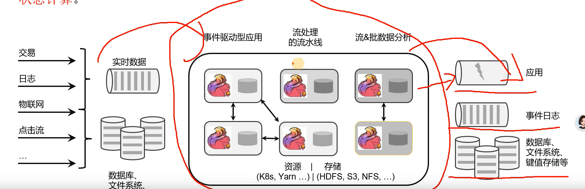
3. Flink是一个开源的、分布式、高性能、高可用的流计算框架，其核心思想就是有状态流计算。在Flink中批处理（有限数据集）是流处理（无限数据集）的一个特例。Flink最强大的是有状态计算（类似动规），比如计算每秒/每分钟的总销售额、一段时间的热门商品排行榜，即要使用之前的状态。Flink和kafka经常结合使用，flink作为kafka的消费者，从指定topic中消费数据，并进行计算，然后返回结果，比如：数据源->kafka->flink（kafka的后端消费者）->结果输出（如数据库、另一个kafka topic等）。注意不是所有情况下用kafka的时候都要用flink，对于有状态计算，即数据处理需要从单条消息处理升级到跨消息（即跨状态）的复杂计算时就可用flink。对于实习中，我都是没有涉及到有状态的计算的，每条消息都是独立的，消费一条消息时不需要知道其它任何消息，因此都是后端服务直接消费kafka，没用flink
4. 流处理：流处理主要针对的是数据流，特点是无界、实时，对系统传输的每个数据依次执行操作，一般用于实时统计。在流处理中，数据被视为无限连续的流，并且会尽快地进行处理。Flink在此模型下可以提供秒级甚至毫秒级的延迟，使其成为需要快速反应和决策的场景（例如实时推荐、欺诈检测等）的理想选
5. 批处理：批处理，也叫作离线处理，一般用于离线统计。这是一种处理存储在系统中的静态数据集的模型。在批处理中，所有数据都被看作是一个有限集合，处理过程通常在非交互式模式下进行，即作业开始时所有数据都已经可用，作业结束时给出所有计算结果。由于批处理允许对整个数据集进行全面分析，因此它适合于需要长期深度分析的场景（如历史数据分析、大规模ETL任务
6. 无界数据流：有定义流的开始，但没有定义流的结束，它们会无休止的产生数据；无界流数据必须持续处理，即数据被摄取后需要立刻处理。不能等到所有数据都到达再处理，因为输入是无限的。比如：kafka等
7. 有界数据流：有定义流的开始，也有定义流的结束；有界流可以在摄取所有数据后再进行计算（批处理），也可以来一条处理一条（流处理）；有界流所有数据可以被排序，所以并不需要有序摄取；有界流处理通常被称为批处理。如：一个文件等
8. Flink 把批处理，当成一种 “有边界、会结束” 的特殊流处理
9. 在 Flink 的视角里，一切数据都可以认为是流，流数据是无界流，而批数据则是有界流
10. <mark>对于一个fink作业，如果它是有界流：文件、集合、固定离线数据，那么数据读完就结束，作业自动退出；如果是无界流：Socket、Kafka、MQ，数据源会持续等待新数据，没有 “读完” 的概念，程序会持续运行，一直阻塞等待新数据的出现，不会终止任务，除非手动在 IDEA 点停止按钮； nc 服务断开（比如nc -lk 7777 关闭），Socket 连接断开，source 抛出异常，作业失败退出； 程序内部代码抛出异常（Kafka 连接失败、事务初始化失败、Checkpoint 持续失败等）； 服务器 kill 掉 Java 进程</mark>
11. 有状态流处理：把流处理需要的额外数据保存成一个“状态”，然后针对这条数据进行处理，并且更新状态
    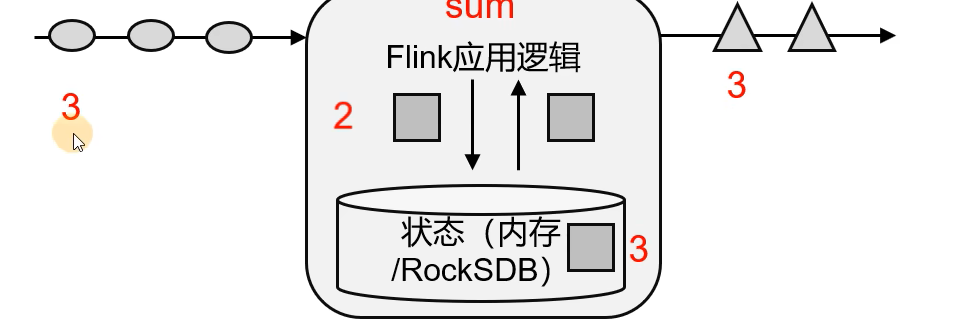
12. Flink特点：
     * 高吞吐和低延迟：每秒处理数百万条消息，延迟在毫秒级
     * 结果的准确性：Flink提供了事件时间（事件发生的时间）和处理时间（消息被处理的时间，消息从产生到处理可能会因为传传输而有一定延迟）语义。对于乱序事件流，事件时间语义仍然能提供一致且准确的结果
     * 支持有状态计算，并且支持多种状态内存、 文件、RocksDB
     * 支持高度灵活的窗口（Window） 操作 time、 count、 session
     * 精确一次的状态一致性保证：不丢失、不重复处理消息来保证一致性
     * 可以连接到最常用的存储系统：kafka、hive、jdbc、hdfs、redis等
     * 高可用：本身高可用的设置，加上与K8s、YARN和Mesos的集成，可以实现高可用
13. Hive表是一个底层数据实际存放在HDFS中的逻辑表，使用它后可以使用类sql语句进行访问数据（元数据在 Hive Metastore、数据在 HDFS、用类 SQL 语言定义的‘分布式文件视图’）
14. 一个节点就是一台机器（服务器/PC机）
15. <mark>HDFS：它是一个分布式文件系统，实际上就是对部署在多台独立物理机器上的文件进行管理。HDFS由NameNode和DataNode组成：</mark>
    * NameNode（主管理节点）：在单个 HDFS Namespace 下，只有一组 NameNode（HA 模式下为 Active+Standby）；但整个集群可以通过 Federation 部署多组 NameNode。用于保存文件系统元数据：文件夹、文件名、文件由哪些 Block 组成、Block 在哪个 DN。不存真实业务数
    * DataNode（数据节点）：集群多台机器全部部署 DN 进程，实际保存 Block 原始数据，数据落地本机磁盘；定时上报块信息给 NN
      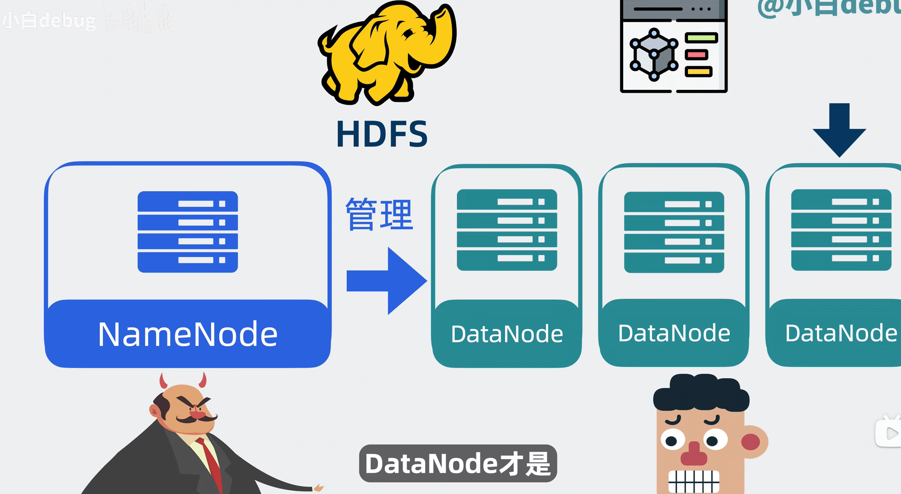
16. 一个NameNode或DataNode就叫一个HDFS节点，多个节点可以组成一个HDFS集群
17. Spark以批处理为根本，微批处理；Flink是流处理
    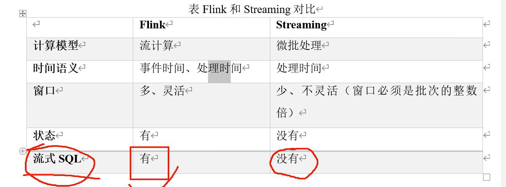
18. <mark>Flink VS Spark：</mark>
    * 一般来说，Spark 基于微批处理的方式做同步总有一个“攒批”的过程，所以会有额外开销，因此无法在流处理的低延迟上做到极致
    * 在低延迟流处理场景，Flink 已经有明显的优势。而在海量数据的批处理领域，Spark 能够处理的吞吐量更大
    * Spark Streaming中的流计算其实是微批计算，实时性不如Flink，还有一点很重要的是Spark Streaming不适合有状态的计算，得借助一些存储如：Redis，才能实现。而Flink天然支持有状态的计算
19. Flink应用常见：
    * 电商和市场营销：比如实时数据报表、广告投放、实时推荐（流式计算的实时性）
    * 物联网
    * 物流配送和服务业
    * 银行和金融行业
20. Flink 就是目前全球业界最主流、最标准、最强大的实时处理引擎，因为它是原生流处理，而不是批处理
21. Flink分层API：
    * 底层API：有状态流处理
    * 核心API：DataStream/DataSet API
    * 声明式领域专用语言：Table API
    * 最高层语言：SQL
    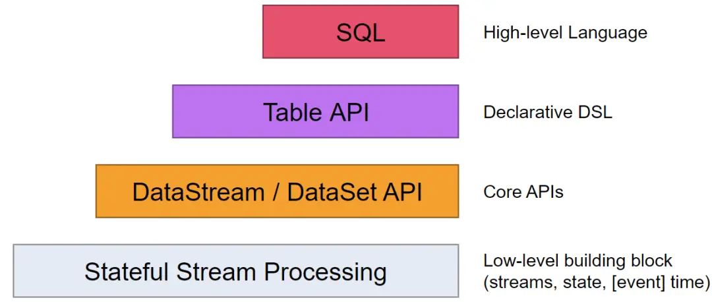
22. <mark>MySQL大多数情况是基于磁盘的持久化数据库。当使用`Memory`存储引擎时所有数据是存在内存中的，而表结构还是在磁盘中</mark>
23. 提交作业=提交flink应用
24. <mark>所有的Flink程序都可以归纳为三部分构成：Source数据源会源源不断的产生数据，Transformation将产生的数据进行各种业务逻辑的数据处理，最终由Sink输出到外部（console、kafka、redis、DB...）：</mark>
    * `Source`：”源算子“，负责读取数据源
    * `Transformation`：”转换算子“，利用各种算子进行处理加工（比如：keyBy、sum、map等）
    * `Sink`：”下沉算子“，负责数据的输出
25. <mark>所有基于Flink开发的程序都能够映射成一个Dataflows图</mark>
    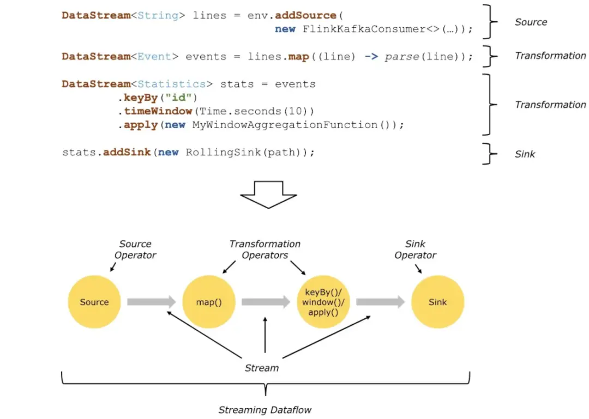
    <mark>当Source数据源的数量比较大或计算逻辑相对比较复杂的情况下，需要提高并行度来处理数据，采用并行数据流。通过设置不同算子的并行度，比如Source并行度设置为2，map也是2，此时会启动2个并行的线程来处理数据</mark>
    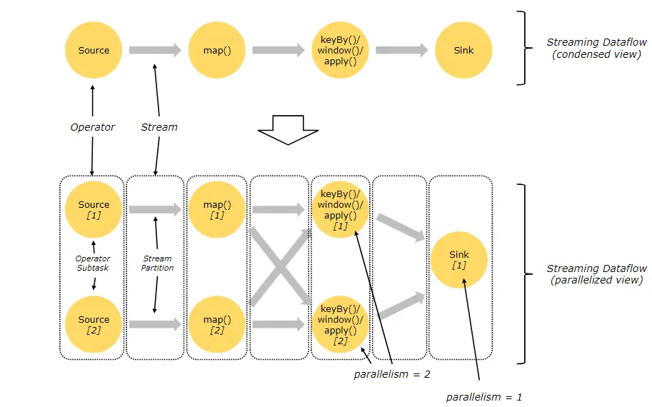
26. DataSet API只能是批处理，它是一口气把所有数据拿到后再处理，而不是来一条处理一条，以WordCut为例，其输出结果为：
    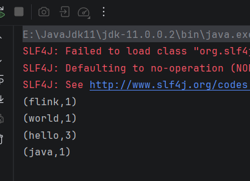
    而DataStream API是流处理，它是来一条处理一条，以WordCut为例，其输出结果为：
    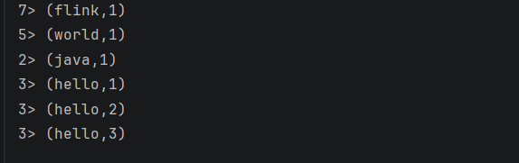（前面的输出编号指的是子任务标号，观察数据被分发到哪个分区（子任务）中执行了，根据自己电脑线程数决定的）
    这个结果也能体现“有状态计算”，在聚合得到3时，2会被Flink自身保存维护，没有用到外部redis等保存
27. 从Flink1.12开始，官方推荐的做法是直接使用`DataStream API`，对于要进行批处理只需要将执行模式设为`BATCH`即可，如`env.setRuntimeMode(RuntimeExecutionMode.BATCH);`
28. DataStream API中必须调用`env.excute()`
29. <mark>java的泛型会在编译阶段进行泛型擦除，如果要使用泛型类型进行链式调用后续方法，需要显示指定泛型类型，否则会报错，比如：</mark>
    ```java
    StreamExecutionEnvironment env = StreamExecutionEnvironment.getExecutionEnvironment();
    // 读取数据 socket，通过端口模拟无界数据流的输入
    DataStreamSource<String> socketDS = env.socketTextStream("localhost", 7777);
    // 处理数据：切分（切分成一个一个单词）、转换（转换为二元组）、分组（一样的单词一组分组）、聚合（一个组内按照个数聚合）
    SingleOutputStreamOperator<Tuple2<String, Integer>> result = socketDS.flatMap((String value, Collector<Tuple2<String, Integer>> out) -> {
            String[] words = value.split(" ");
            for (String word : words) {
                if (!word.trim().isEmpty())
                    out.collect(Tuple2.of(word.trim(), 1));// 使用Collector向下游发送元组
            }
    }
    )
    // 此时如果直接.keyBy()会报错，因为运行时Tuple2<String, Integer>这个类型会被擦除，因此要用returns显示指定出返回类型
    .returns(Types.TUPLE(Types.STRING, Types.INT))// 需要显示指定返回类型，不然用lambda表达式会出现泛型擦除，导致识别不到传入的泛型类型Tuple2<String, Integer>
    .keyBy(value -> value.f0)
    .sum(1);
    // 输出数据
    result.print();
    // 执行任务
    env.execute();
    }
    // Tuple2是个泛型类
    ```
30. Flink集群是一个典型的Master-Slave架构，架构中包含了两个重要角色，分别是「JobManager」和「TaskManager」。 JobManager相当于是Master，TaskManager相当于是Slave：
    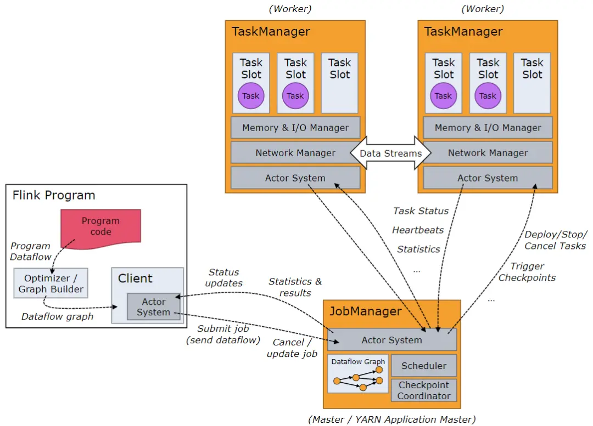
    <mark>在Flink中，JobManager负责整个Flink集群任务的调度以及资源的管理。它从客户端中获取提交的应用，然后根据当前Flink集群中TaskManager上TaskSlot的使用情况，为提交的应用分配相应的TaskSlot资源并命令TaskManager启动从客户端中获取的应用。 TaskManager则负责执行作业流的Task，并且缓存和交换数据流。 在TaskManager中资源调度的最小单位是Task slot，默认一个TaskManager有一个Task slot。TaskManager中Task slot的数量表示并发处理Task的数量，slot的数量限制了TaskManager能够并行处理的任务数量。
    一台机器节点可以运行多个TaskManager，TaskManager工作期间会向JobManager发送心跳保持连接</mark>
31. <mark<在 IDEA 右键Flink程序的main方法直接跑，Flink 启动本地迷你集群，所有`TaskManager、JobManager`都在同一个本地JVM进程里，此时`print()`这个`sink`算子输出会直接打到 IDEA 下方的 Run 控制台窗口</mark>
32. <mark>编写的Flink作业代码可以通过`WEB UI`(这个UI是Flink JobManager 的 Web UI)提交(Apache Flink 集群的 Web UI 监控页面)，也可以直接命令行提交`bin/flink run -m [JobManager地址:port] -c [作业的全类名] [jar包路径]`，命令行提交更常用</mark>
33. 可以在`Apache Flink`上查看当前部署的集群，此时可以`localhost:8081`或者`172.17.87.132:8081`访问Flink集群的WEB UI监控页面：
    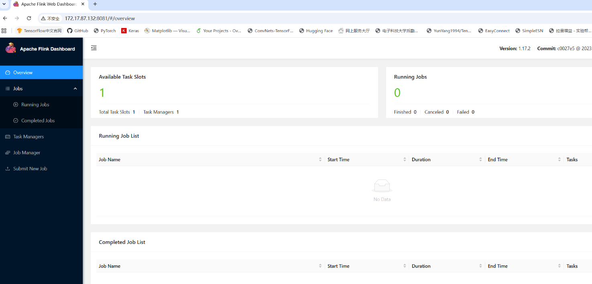(这是Apache Flink 的 Web UI 监控面板)
    在wsl中启动nc，然后提交作业到WEB UI，查看其日志：
    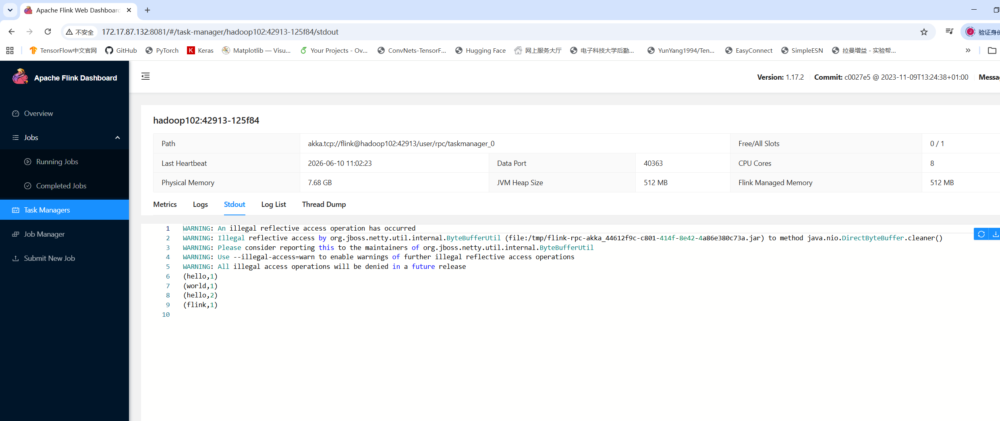
34. WSL和Windows是不同的操作系统，Flink集群部署到wsl中，那么就要在wsl中打开`nc -l -p 7777`，而不是在windows中打开，虽然此时可以通过windows的WEB UI看到WSL中部署的flink集群，那是因为：Windows 是它的 “宿主机”，两者之间网络是通的，像同一台电脑上的两个系统，
你在 WSL2 里启动一个服务，监听 0.0.0.0:8081（Flink 就是这样，flink-conf.yaml就配置了`rest.bind-address: 0.0.0.0`，表示监听所有网卡、所有 IP）。 WSL2 会自动把这个端口 “映射” 到 Windows 的 localhost 上。 所以：Windows 浏览器访问 localhost:8081，或者访问WSL的IP 172.17.87.132:8081都能直接连到WSL里的Flink JobManager。
但是不能写成127.0.0.1，就只能 WSL 内部访问，Windows 就打不开了
35. Flink为各种场景提供了不同的部署模式：
    * 会话模式：需要提前启动一个集群，保持一个会话，在这个会话中通过Flink客户端（例如CLI、REST API或Web UI）提交作业。集群启动时所有资源就都已经确定了，所以所有提交的作业会竞争集群中确定的资源。会话模型比较适合于单个规模小、执行时间短的大量作业
    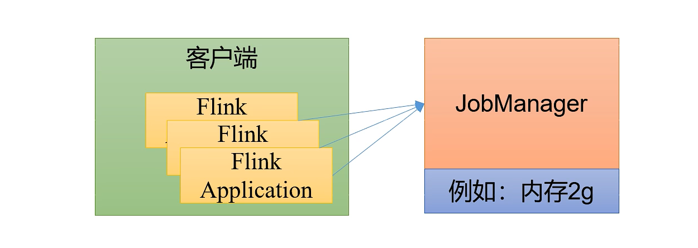
    * 单作业模式：会话模式因为资源共享导致很多问题，所以为了更好地隔离资源，就出现了单作业模式。每个作业都有自己的集群。需要注意的是，Flink本身无法直接运行单作业模式，一般需要借助一些资源管理框架来启动集群，比如：YARN、K8S等（对于每个提交的作业，都会启动一个新的 Flink 集群，然后再执行该作业。作业完成后，相应的 Flink 集群也会被终止。这种模式适合长时间运行的作业）
    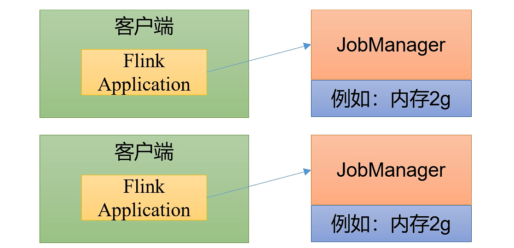
    * 应用模式：前两种模式的应用代码都是在客户端上执行，然后由客户端提交给JobManager的。但是这种方式客户端需要占用大量网络带宽，去下载依赖和把二进制数据发送给JobManager。我们提交作业一般都是同一个客户端，此时会加重客户端所在节点的资源消耗。解决办法就是：不要客户端，直接把应用提交到JobManager上运行。而这也代表着，我们需要为每一个提交的应用单独启动一个JobManager，也就是创建一个集群。这个JobManager只为执行这一个应用而存在，执行结束之后JobManager也就关闭了。一个Flink应用会启动一个Flink集群（这种模式是一种特殊的 Per-Job 模式，它允许用户以反应式的方式与作业进行交互（比如，使用 DataStream API）。这是 Flink 1.11 版本引入的新模式，它结合了Session模式和Per-Job模式的优点。在Application模式下，每个作业都会启动一个独立的Flink集群，但是作业提交快）
    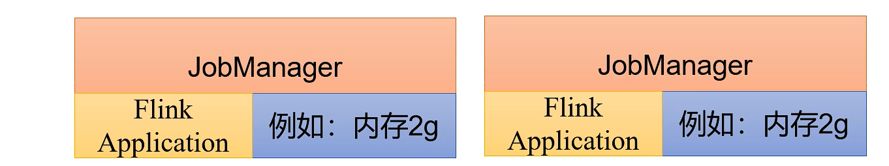
36. 应用模式和单作业模式都是提交作业之后才创建集群；单作业模式是通过客户端来提交的，客户端解析出的每一个作业对应一个集群；而应用模型下，是直接由JobManager执行应用程序的
37. 不管是什么部署模式，一个作业对应一个新的jobmaster
38. <mark>应用模式和单作业模式提交一次作业，就启动一个新的集群，即会完整启动一套全新 JobManager；而会话模式不会启动新的集群，只是会一个作业对应一个新的jobmaster</mark>
39. <mark>Flink的运行模式：</mark>
    * Standalone模式：Standalone模式是在一个独立的集群中运行Flink。它需要手动启动Flink集群，并且需要手动管理资源，`bin/start-cluster.sh`启动的就是Flink独立集群模式-Standalone模式中的会话模式。Standalone模式的优点是部署简单，可以跨多台机器运行，缺点是需要手动管理资源。对于Standalone模式中的应用模式不能直接用`bin/start-cluster.sh`启动集群，需要使用脚本手动打开JobManager和TaskManager。此模式用的很少
    * <mark>YARN模式：YARN上部署的过程是：客户端把Flink应用提交给YARN的ResourceManager，YARN的ResourceManager会向YARN的NodeManager申请容器。在这些容器上，Flink会部署JobManager和TaskManager的实例，从而启动Flink集群。Flink会根据运行在JobManager上的作业所需要的Slot数量动态分配TaskManager资源，如果没有运行的作业就会回收</mark>（这个模式下，Flink作为YARN的一个应用程序运行在YARN集群中。Flink会从YARN获取所需的资源来运行JobManager和TaskManager。如果你已经有了一个运行Hadoop/YARN的大数据平台，选择这个模式可以方便地利用已有的资源，这是企业中用的比较多的方式）
    启动YARN模式：`start-dfs.sh`、`start-yarn.sh`
    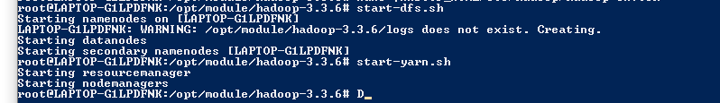
    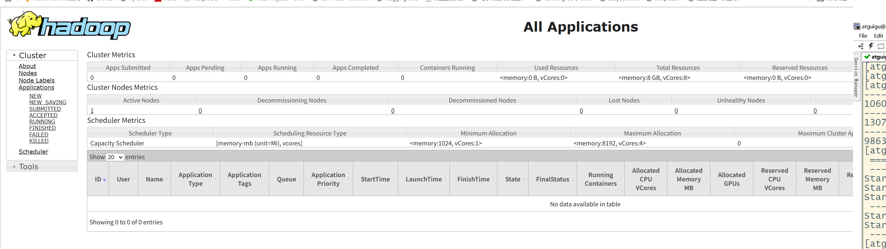(这是Hadoop YARN ResourceManager 的 Web UI 监控页面)
    YARN运行模式上以会话模式启动：
    `./yarn-session.sh`    
    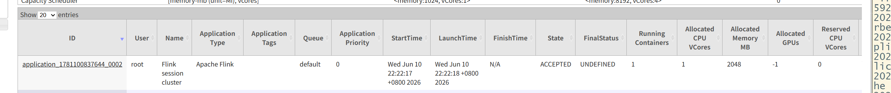
    提交作业，此时会自动分配TaskManager和Task slot：
    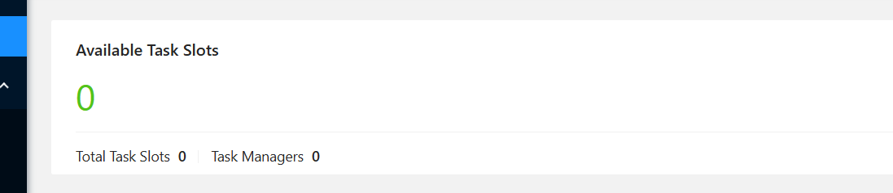
    
    当然把作业取消，此时YARN也会管理自动释放TaskManager和Task slot：
    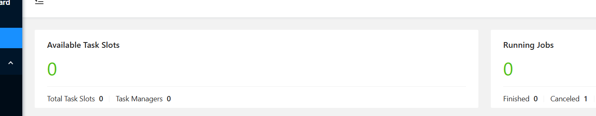
    YARN运行模式上以单作业模式启动并提交作业：
    `bin/flink run -d -t yarn-per-job -c org.example.WordCountStreamUnboundDemo Flink1.17-1.0-SNAPSHOT.jar`
    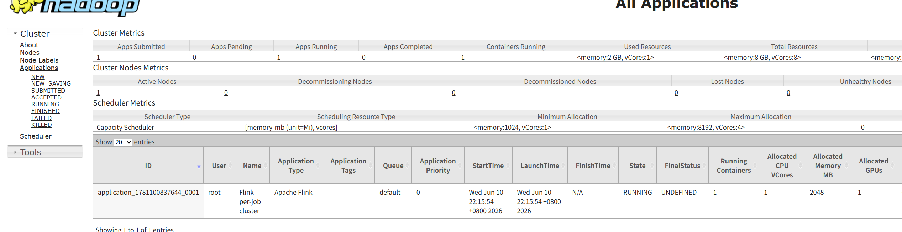
    YARN运行模式上以应用模式启动并提交作业：
    `bin/flink run-application -t yarn-application -c org.example.WordCountStreamUnboundDemo ./Flink1.17-1.0-SNAPSHOT.jar`
    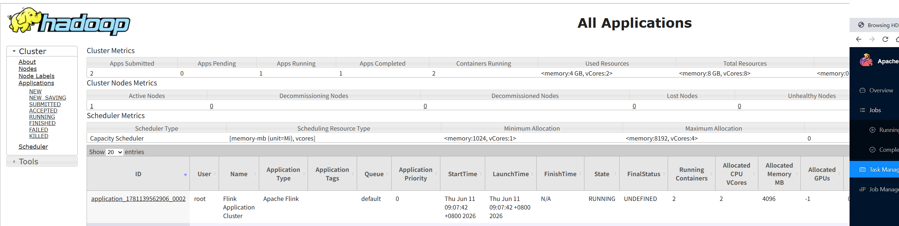
40. <mark>Standalone模式下，`bin/start-cluster.sh`启动的就是Flink独立集群模式-Standalone模式中的会话模式</mark>
41. <mark>使用YARN模式必须要先启动Hadoop。Flink 的 YARN 模式本质上是把 Hadoop YARN 作为资源调度器，让 YARN 来管理 Flink 任务的资源分配和集群生命周期。要让它正常工作，必须先启动 Hadoop 里的HDFS和YARN服务</mark>
42. <mark>`jps`可以用来查看java进程</mark>
43. `tail -f $HADOOP_HOME/logs/hadoop-root-*-*.log`：查看Hadoop日志
44. <mark>为了更快速上传application，可以先把：flink依赖、jar包这些提前上传到HDFS中，然后jobmanager直接从HDFS中读取这些依赖，就不用每一次都本地上传了。此时任务启动时不再重复上传 Flink 基础依赖，仅加载业务 Jar，启动速度大幅提升，这种方式在多任务、频繁提交作业的场景收益明显</mark>
    * 上传flink依赖：`hadoop fs -mkdir /flink-dist`、`hadoop fs -put lib/ /flink-dist`、`hadoop fs -put plugins/ /flink-dist`
    * 上传jar包：`hadoop fs -mkdir /flink-jars`、`hadoop fs -put Flink1.17-1.0-SNAPSHOT.jar /flink-jars`
    * 上传到hdfs后可以在网页查看`http://localhost:9870/explorer.html#/`
    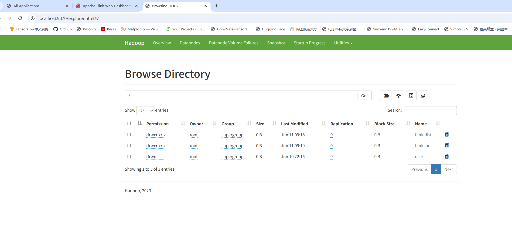(这是Hadoop HDFS NameNode 的 Web UI 监控页面)
    * 通过上传到hdfs的依赖和jar包，可以直接利用它们提交作业：` bin/flink run-application -t yarn-application -Dyarn.provided.lib.dirs="hdfs://localhost:9000/flink-dist" -c org.example.WordCountStreamUnboundDemo hdfs://localhost:9000/flink-jars/Flink1.17-1.0-SNAPSHOT.jar`
45. 在实际开发中，推荐使用YARN+应用模式+提前上传依赖和jar包到HDFS的方法。也就是实际开发中：我们一般不会直接
46. 历史服务器：运行Flink的集群一旦停止，只能去yarn或本地磁盘上查看日志，不可以再查看作业挂掉之前的运行的WEB UI，很难清楚知道作业在挂的那一刻到底发生了什么。Flink提供了历史服务器，用来在相应的Flink集群关闭后查询已完成作业的统计信息
    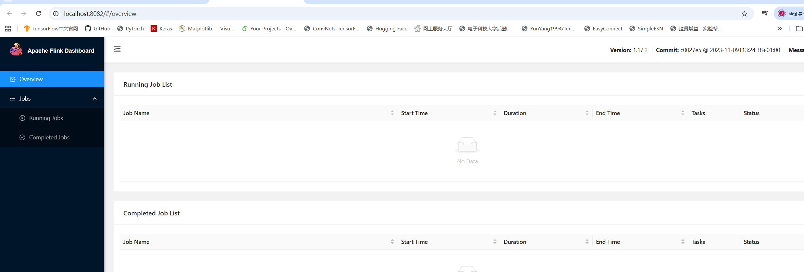
    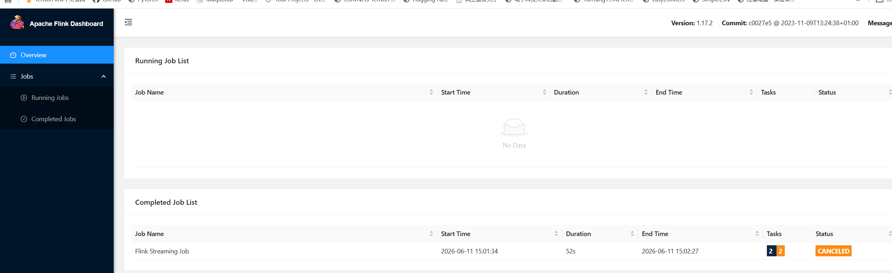
47. Flink运行时架构，以Session模式为例：
    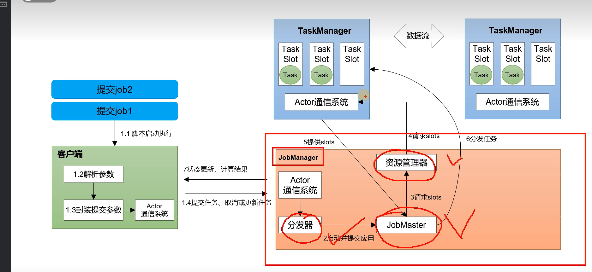（每个提交的作业，都会在 JobManager 里启动一个独立的 JobMaster 实例，从头到尾管这一个 Job。一个作业对应一个jobmaster）
48. <mark>算子：对流式数据做处理、转换、计算、输出的逻辑单元，是 Flink 程序里最基本的运算步骤。Flink算子分类：Source 数据源算子(`socketTextStream(host, port)`、`readTextFile()`)、Transformation 转换算子(`map`、`filter`、`keyBy`)、Sink 输出算子(`print()`)</mark> 
49. `print()` 是 Flink 内置、开箱即用的测试专用 Sink，不需要配置任何外部存储，直接把流数据打印到 TaskManager 的控制台日志，本地调试代码首选
50. 在Flink执行过程中，每一个算子（operator）可以包含一个或多个子任务，这些子任务在不同的线程、不同的物理机或不同的容器中完全独立地执行。一个特定算子的子任务的个数被称之为其并行度。整个流处理程序的并行度，就应该是所有算子并行度中最大的那个，这代表了运行程序需要的 slot 数量
51. Flink中每一个算子的并行度可以不一样，设置方法是：`setParallelism(并行度)`，比如给`socketTextStream`算子设置并行度1：` DataStreamSource<String> socketDS = env.socketTextStream("localhost", 7777).setParallelism(1);`
52. Flink的流式代码：数据源 (Source) → 一系列算子 → 输出 (Sink)
53. <mark>`StreamExecutionEnvironment env = StreamExecutionEnvironment.createLocalEnvironmentWithWebUI(new Configuration());`：创建带内置 Web UI 的本地 Flink 流运行环境（没有独立的外部集群，是在当前 Java 进程内模拟的嵌入式本地迷你集群，跑在你运行代码的这台机器），本地运行任务时，可通过网页直观监控作业、算子、Slot、数据流等状态。此时在本地开发环境的IDEA中运行代码后，默认访问：http://localhost:8081，和独立 Flink 集群 Web UI 界面完全一样。这种方法仅用于本地开发、测试、debug；生产环境绝对不用</mark>
    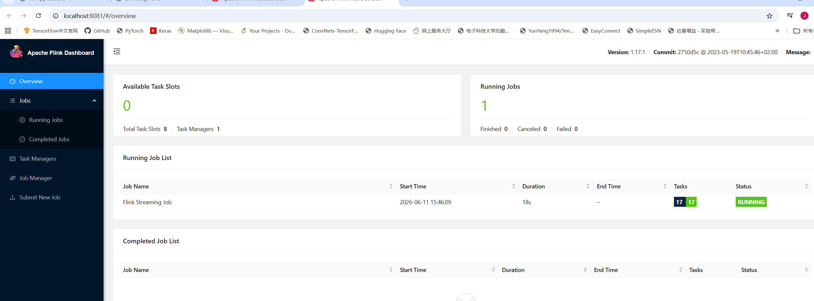
54. 全局设置并行度，所有算子都一样`env.setParallelism(3)`，还可以在WEB UI或命令行(可以增加 -p 参数来指定当前应用程序执行的并行度)提交作业时指定。并行度优先级：算子设置并行度>代码全局设置并行度>命令行或WEB UI提交时指定>flink-conf.yaml配置文件
55. 并行度示例：由于`print()`没有设置并行度，那么默认是电脑线程数8，所以打印的时候顺序会随机
    ```java
    StreamExecutionEnvironment env = StreamExecutionEnvironment.getExecutionEnvironment();
    // 从集合读取数据
    DataStreamSource<Integer> source = env
            .fromElements(1, 2, 3, 4, 5);
    //                .fromCollection(Arrays.asList(1, 2, 3, 4, 5));
    source.print();
    env.execute();
    ```
56. Flink中算子之间的传输关系：one to one；重分区
57. <mark>算子链（这是一种优化措施）：将算子链接成task是非常有效的优化，可以减少线程之间的切换和基于缓存区的数据交换，在减少时延的同时提升吞吐量（在 Flink 中，Task 是一个阶段多个功能相同 subTask 的集合，Flink 会尽可能地将 operator 的 subtask 链接（chain）在一起形成 task。每个 task 在一个线程中执行。将 operators 链接成 task 是非常有效的优化：它能减少线程之间的切换，减少消息的序列化/反序列化，减少数据在缓冲区的交换，减少了延迟的同时提高整体的吞吐量。）</mark>
    * Flink中算子串子一起的条件
      * one to one
      * 并行度相同
    * <mark>Flink中，并行度相同的one to one算子操作，可以直接链接在一起形成一个”大“的任务，此时这两个算子操作是forward关系。这样原来的算子就称为了真正任务里的一部分。每个task会被一个线程执行，这样的技术就是算子链。比如下图：原来本来Source、map是4个子任务、2个任务，现在合并后变成了2个子任务，1个任务了</mark>
    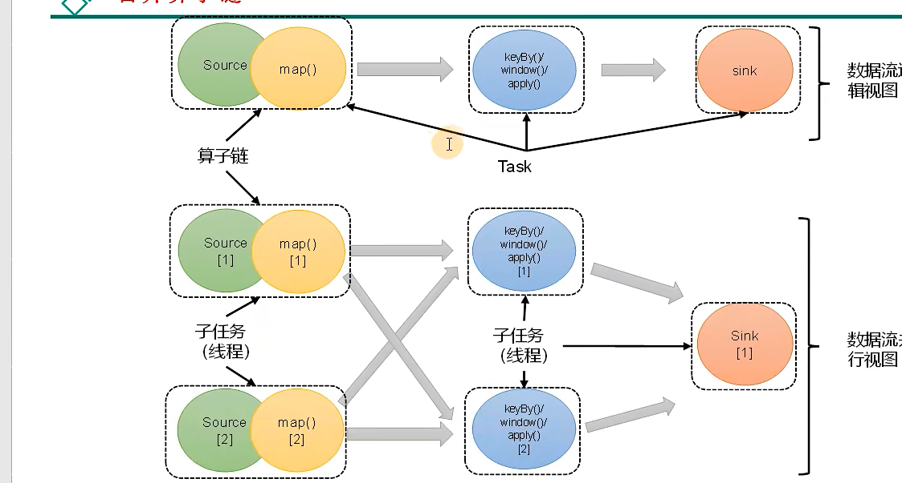
    一个算子的并行度是n，那么这个算子就会生成n个子任务
    * <mark>和Spark类似，其实Flink中task的划分也是依据宽依赖（只是在flink中叫重分区），当出现宽依赖就会一个新的task</mark>
    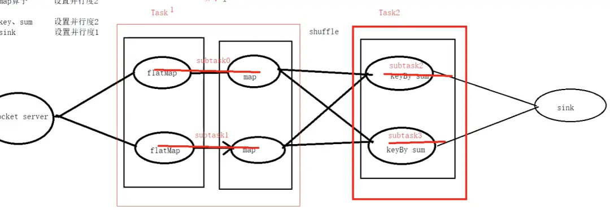
    * 禁用算子链：
      * 全局禁用算子链：`env.disableOperatorChaining()`
      * 某个算子不参与链化：`A.disableChaining()`；算子A不会与前面和后面的算子的串在一起
      * 从某个算子开启新链条：`A.startNewChain()`；算子A不与前面串在一起，从A开始正常链化
58. <mark>子任务是物理执行单元，归属于算子/算子链，不是全局的概念。无重分区时，多个forward关系的算子可以合并成一条算子链，此时整条链共享一份并发实例，这一份实例就叫一个 SubTask。而一旦触发重分区（keyBy/rebalance/shuffle 等），算子链断开，上下游各自拥有独立的子任务集合</mark>
59. WEB UI中一个框框就是一个任务，从这个框框中也可以看出分task的依据：因为HASH(对应的就是`.keyBy()`)是一个重分区操作（也就是遇到了宽依赖），那么就是一个新的task
    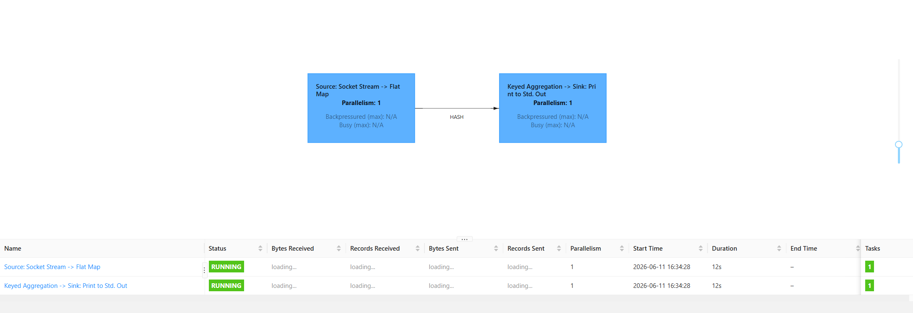
60. Flink中每一个TaskManager都是一个JVM进程，它可以启动多个独立的线程，来并行执行多个子任务。为了控制并发量，需要在TaskManager上对每个任务运行所占用的资源做出明确划分，这就是所谓的task slots
61. 每个task slot表示的是TaskManager拥有计算资源的一个固定大小的子集，这些资源就是用来独立执行一个子任务的
62. <mark>同一TaskManager 内不同 Task Slot 相互独立、并发执行</mark>
63. <mark>Task slot和子任务的关系：</mark>
    * 常规情况：一个 SubTask 占用 一个 Task Slot
    * 算子链场景：多个上下游算子被链在一起，合并成一个 Task，对应一个 SubTask，依旧只占用 一个 Slot
    * 共享 Slot 组：Flink 默认开启槽位共享：同一个作业的不同算子的子任务，可以共用同一个 Slot
64. `flink-conf.yaml`配置文件中可以设置每个TaskManager的Slot数量：`taskmanager.numberOfTaskSlots: 10`，可以给每个TM配置不同的slot数量
65. <mark>需要注意的是：task slot对内存是硬隔离的，而cpu不是硬隔离。slot目前仅仅用来隔离内存，不会涉及cpu的隔离，cpu还是大家共用的。在具体开发时，可以将slot数量配置为机器的cpu核心，尽量避免不同任务之间对cpu的竞争。因为：Slot 只是线程分组，不会用操作系统机制把某个 Slot 绑定到指定 CPU 核心。所有 Slot 的线程共用机器 CPU 核心，运行时会互相抢占 CPU 时间片，做不到彻底隔离</mark>
66. <mark>不同的Task下的subtask要分发到同一个TaskSlot中，降低数据传输、提高执行效率；相同的Task下的subtask要分发到不同的TaskSlot中，以提高并行度</mark>
    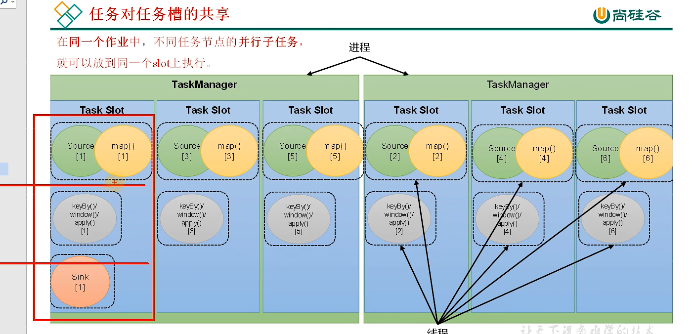
67. 资源充足情况下：相同算子的不同子任务，分布在不同 Slot 并行运行；资源不足时：多个同算子的子任务会运行在同一个 Slot，串行执行
68. task slot特点：
    * 均分隔离内存，不隔离cpu
    * 可以共享：同一个job中，不同算子的子任务才可以共享同一个slot，此时同时在运行的，前提是，属于同一个slot共享租，默认都是"default"
69. <mark>flink默认是允许slot共享的，如果希望某个算子对应的任务完全独占一个 slot，或者只有某一部分算子共享 slot，在Flink中，可以通过在代码中使用`slotSharingGroup()`方法来设置slot共享组。Flink会将具有相同slot共享组的操作放入同一个slot中，同时保持不具有slot共享组的操作在其他slot中。这可以用来隔离slot：</mark>
    `dataStream.map(...).slotSharingGroup("group1");`：这样，只有属于同一个 slot 共享组的子任务，才会开启 slot 共享，不同组之间的任务是完全隔离的，必须分配到不同的 slot 上
70. 默认的slot共享组是"default"，如果未指定slot共享组，那么所有子任务都会被分配到"default"组中，此时所有算子操作都是一个slot共享组
71. <mark>流程序中最大算子并行度=运行所需要的slot数量</mark>
72. 并行度和slots数量的关系；
    * slots是一种静态的概念，表示最大的处理并发上限
    * 并行度是一种动态的概念，表示实际运行占用了几个
    * <mark>要求：slot数量>=job并行度（算子最大并行度），job才能运行，不然运行失败(这是standalone模式)。如果是YARN模式，它会自动根据提交的job的并行度，来申请taskManager的数量（申请规则：taskManager的数量=job并行度/slot数量，向上取整）</mark>
    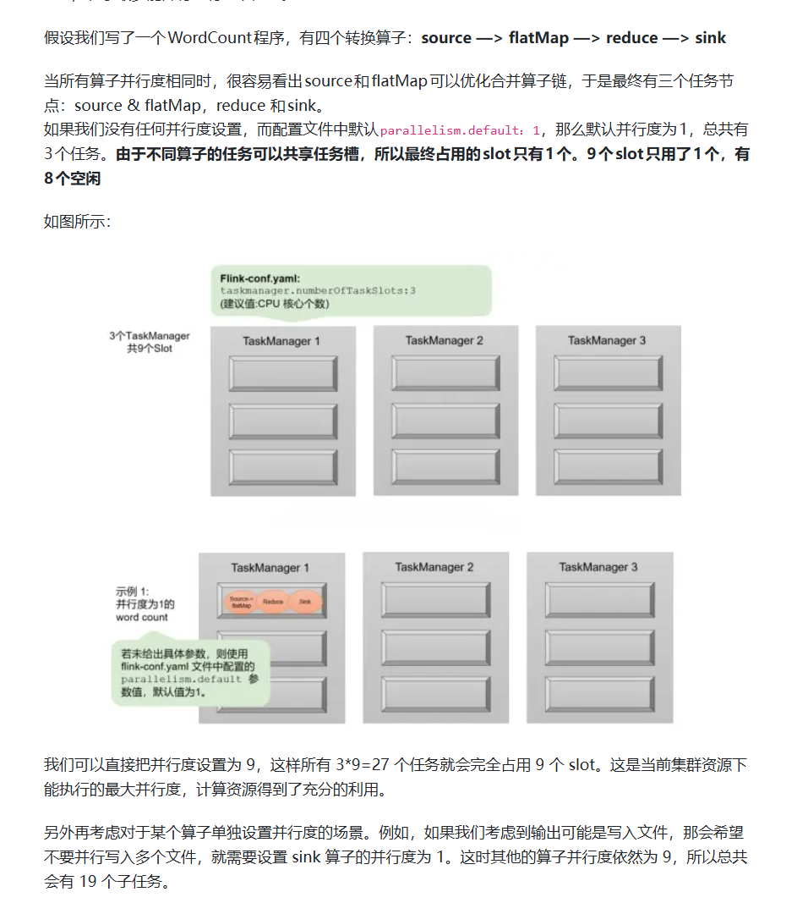
73. Standalone会话模式作业提交流程：
    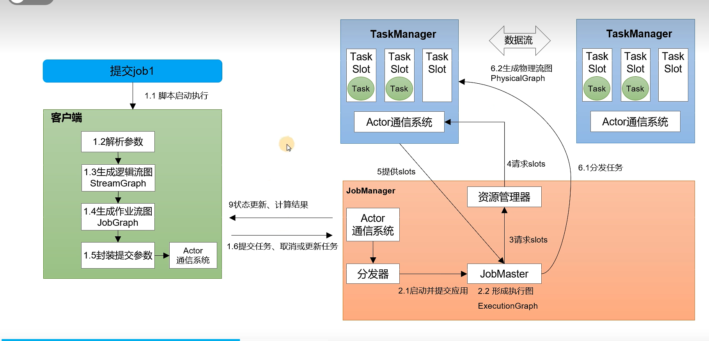（逻辑流图到作业流图最重要的就是进行算子链优化；jobmaster把作业流图转换为执行图）
74. YARN应用模式作业提交流程：
    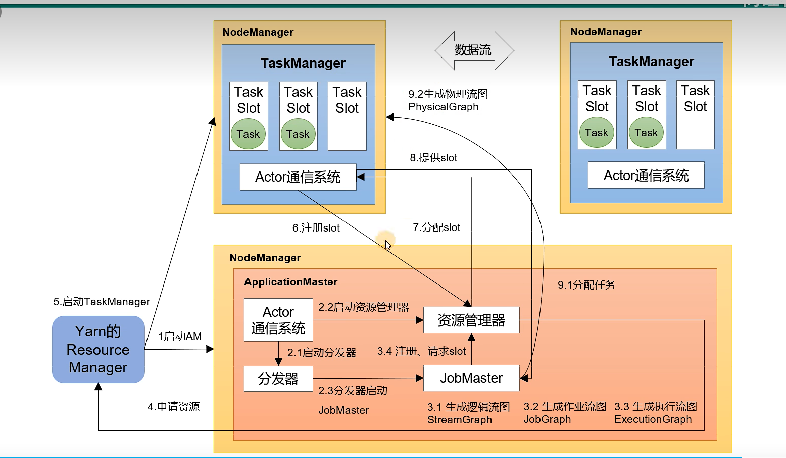
75. <mark>`DataStream` API代码由以下几部分组成：</mark> 
    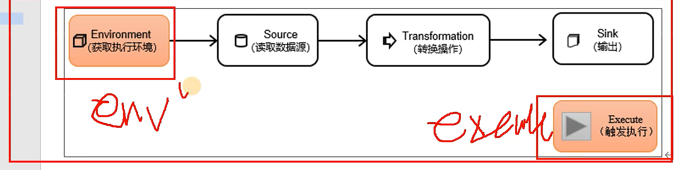
76. DataStream API：
    * 创建执行环境：`StreamExecutionEnvironment.getExecutionEnvironment()`：自动识别是远程集群还是本地IDEA环境，可以通过`new Configuration()`来指定：
      * `Configuration conf = new Configuration();     conf.set(RestOptions.BIND_PORT, "8082");      StreamExecutionEnvironment.getExecutionEnvironment(conf)`：这是设置的IDEA打开的本地Flink集群端口，与Standalone、YARN模式等无关
    * Flink流批一体，代码api是一套，默认是流处理，设置为批处理：`env.setRuntimeMode(RuntimeExecutionMode.BATCH);`；批处理设置也可以在命令行提交作业时指定：`-Dexecution.runtime-mode=BATCH`
    * 最后一定要有一个程序的触发执行，前面其实只是定义了作业的每个执行操作，然后添加到数据流图中，这时并没有真正处理数据——因为数据可能还没来，只有等到数据到来，才会从触发真正的计算，这也被称为“延迟执行”：`env.execute();`
    * 默认`env.execute`触发一个flink job，一个main方法可以调用多个execute，但是没意义，指定到第一个就会阻塞住；`env.executeAsync();`表示异步触发，不阻塞，此时一个main方法里面`env.executeAsync();`的个数=生成的flink job(一个flink job对应一个jobmaster)数
77. <mark>注意`DataStream`内只能是相同的数据类型，可以是`自定义统一POJO、Tuple、Sting、Integer`等。而`ConnectedStreams<T1, T2>`：持有两条不同类型流，支持各自处理，不属于同一条`DataStream`</mark>
78. <mark>源算子（Source）：Flink 中 Source 是数据流的起点，负责读取外部数据并生成 DataStream：</mark>
    * 从Flink1.13开始，主要使用流批统一的Source架构：`DataStreamSource<String> stream = env.fromSource(...)`，即都会注册一个Source，并返回一个`DataStreamSource`对象
      * 从集合中读取：`env.fromCollection(Arrays.asList(1, 2, 3, 4, 5));`；`env.fromElements(1, 2, 3, 4, 5);`，这也是注册Source
        * 从文件中读取：`env.readTextFile("path/to/file");`但是从Flink1.13开始就弃了，改用:`FileSource+env.fromSource()`
          * `FileSource.forRecordStreamFormat(...).build();`：创建一个按记录流读取文件的 Source
          * `env.fromSource(Source的实现类，Watermark，名字);`：新版 API 注册 Source 的方式，替代旧版的`env.addSource()`
      ```java
      public static void main(String[] args) throws Exception {
      StreamExecutionEnvironment env = StreamExecutionEnvironment.getExecutionEnvironment();
      env.setParallelism(1);
      // 从文件读取数据
       FileSource<String> filesource = FileSource.forRecordStreamFormat(
               new TextLineInputFormat(),// 文本文件专用格式，按行读取，每一行数据会被解析为一个 String 类型记录
               new Path("E:/BigData/MavenFlink1.17/input/word.txt")
       )
       .build();// 构建完成 FileSource 对象，准备注册到环境中
      DataStreamSource<String> res = env.fromSource(filesource, WatermarkStrategy.noWatermarks(), "filesource");
      res.print();
      env.execute();
      }
      ```
      * 从Socket中读取：`env.socketTextStream(...);`，此时也是组成了Source，并返回一个`DataStreamSource`对象，主要用于测试无界流
      * 从kafka中读取：`KafkaSource+env.fromSource()`
      ```java
      KafkaSource.<String>builder()
                .setBootstrapServers("localhost:9092")// 指定kafka节点的地址和端口
                .setGroupId("example")// 指定消费者组的id
                .setTopics("topic_1")// 指定要订阅的topic
                .setValueOnlyDeserializer(new SimpleStringSchema())// 指定反序列化器，这里使用SimpleStringSchema
                .setStartingOffsets(OffsetsInitializer.latest())// 指定从最新的offset开始读取  从最早开始读取，OffsetsInitializer默认是earliest
                .build();
      DataStreamSource<String> kafkasource = env.fromSource(kafkaSource, WatermarkStrategy.noWatermarks(), "kafkasource");
      kafkasource.print();
      ```
      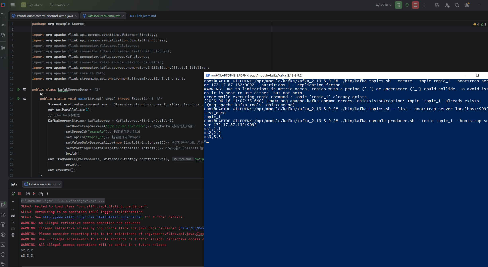
    * 从数据生成器中读取：`DataGeneratorSource+env.fromSource()`
    ```java
    /**
     * 数据生成器Source，四个参数：
     * 第一个：GeneratorFunction，用于生成数据的函数，返回值类型为T，需要自己实现，输入类型固定是Long
     * 第二个：Long类型，自动生成的数字序列最大值，达到这个值就停止
     * 第三个：RateLimiterStrategy，指定数据生成器的速率限制策略，比如每秒生成几条数据
     * 第四个：TypeInformation，指定数据生成器的输出类型信息，默认是Object.class
     */
    DataGeneratorSource<String> dataGenerator = new DataGeneratorSource<>(
            new GeneratorFunction<Long, String>() {
                @Override
                public String map(Long value) {
                    return "Number: " + value;
                }
            },
            10,
            RateLimiterStrategy.perSecond(1),
            Types.STRING
    );
    DataStreamSource<String> datagen = env.fromSource(dataGenerator, WatermarkStrategy.noWatermarks(), "datagen");
    datagen.print();
    ```
    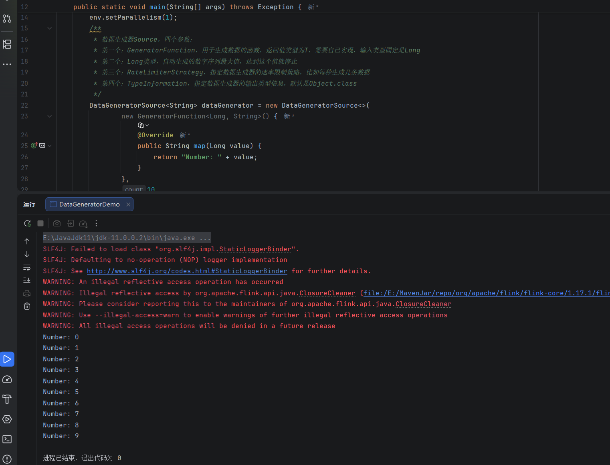
79. <mark>内存中的对象，无法直接在网络上传输，必须经历「序列化→传输→反序列化」的过程。原因：</mark>
      * 网络只能传输「字节流」，一连串的二进制，不能传输「对象」（代码里创建的 User、String、自定义对象，在 JVM 里是内存中的数据结构： 包含对象头、实例数据、引用指针，这些结构是 JVM 私有的，其他进程 / 机器完全无法识别）
      * 跨平台 / 跨语言通信需要统一格式
      * 持久化存储也需要序列化：不仅是网络传输，把对象写入文件、数据库，同样需要序列
80. Flink支持的数据类型是`TypeInformation`类型，其中包含了常见使用的类型，比如`Types.STRING`、`Types.INT`、`Types.LONG`等
81. <mark>Flink中自定义实体类作为数据流传输对象，满足一套规定规则的普通java bean，称作`POJO`。Flink会为`POJO`生成专用序列化器，性能远高于`GenericTypeInformation（ Kryo 序列化）`，推荐业务实体全部使用`POJO`。`POJO`必须同时满足：</mark>
    * 类是public
    * 有无参公共构造函数
    * 所有字段属性必须是public，或提供public getter/setter
    * 所有字段类型可被Flink序列化：基础类型、String、Date、其他 POJO、集合、数组等都可以； 禁止无法序列化的对象（Socket、连接、线程等）
    ```java
    public class User {
    private Long id;
    private String name;
    private Integer age;

    // 1. 无参公共构造器
    public User() {}

    // 全参构造可选，业务使用
    public User(Long id, String name, Integer age) {
        this.id = id;
        this.name = name;
        this.age = age;
    }

    // 2. 全部字段 public getter/setterm  
    public Long getId() { return id; }
    public void setId(Long id) { this.id = id; }

    public String getName() { return name; }
    public void setName(String name) { this.name = name; }

    public Integer getAge() { return age; }
    public void setAge(Integer age) { this.age = age; }
    }
    ```
82. <mark>Flink的基本转换算子：</mark>
    * `map`：就是一个一一映射，消费一个元素就产出一个元素
    * `filter`：转换操作，对数据流执行一个过滤，通过一个布尔条件表达式设置过滤条件，对于每一个流内元素进行判断，若为true则元素正常输出，若为false则元素被过滤掉
    * `flatMap`：压平操作，主要是将数据流中的整体(一般是集合类型)拆分成一个一个的个体使用。消费一个元素，可以产生0到多个元素，使用`out.collect`采集器传到下游，flatmap就是通过采集器来控制一进多出的。它是flatten和map的结合
83. <mark>Flink中流的转换关系：</mark>
    *  Source 生成的初始流都是`DataStream`，`DataStreamSource`继承于`SingleOutputStreamOperator`，而后者继承于`DataStream`；经过转换算子（`map`、`filter`、`flatMap`等）得到的仍然是`DataStream`
    * `DataStream`在`keyBy()`后得到`KeyedStream`键控流（`ConnectedStream`在`keyBy()`后得到的是`ConnectedStream`），分组后做`reduce、window、sum`等操作得到的还是`DataStream`
    * `DataStream`在`connect()`后得到`ConnectedStream`后，此时对`ConnectedStream`进行转换算子（`map`、`filter`、`flatMap`等），得到的还是`DataStream`
84. <mark>Flink的聚合算子：对于Flink而言，DataStream是没有直接进行聚合的API的。因为我们对海量数据做聚合肯定要进行分区并行处理，这样才能提高效率。所以在Flink中，要做聚合，需要先进行分区，即keyBy：</mark>
    * `keyBy`：聚合前必须要用的一个算子，通过指定key可以将一条流从逻辑上划分成不同的组。然后相同组在一个分区，这里的分区，其实就是并行处理的子任务。基于不同的key，流中的数据将被分配到不同的分组中，相同的key在同一个分区。keyBy返回的是一个KeyedStream，键控流；keyBy不是转换算子，只是对数据进行重分区，不能设置并行度
    ```txt
    keyBy分组与分区的区别：
     1）keyBy是对数据分组，保证相同key的数据在同一个分区
     2）分区：一个子任务，可以理解为一个分区，一个分区就是一个并行处理的子任务
    keyBy分的不同分组，可能在相同的分区中，因为此时分区数不足keyBy的分组数
    ```
    ```java
    KeyedStream<WaterSensor, String> waterSensorStringKeyedStream = waterSensorDataStreamSource.keyBy(new KeySelector<WaterSensor, String>() {
        // 重写getKey方法，根据返回的key来分组
        @Override
        public String getKey(WaterSensor value) throws Exception {
            return value.getId();
        }
    });
    ```
    * 简单聚合(分组内聚合)：基于`KeyedStream`的`sum`、`max`、`min`、`avg`、`count`等，也就是对`keyBy()`得到的分组进行简单聚合操作。在Flink中简单聚合算子需要和`keyBy()`成对出现
    * `reduce`：还是要跟在`keyBy()`之后。它是两两聚合，并且对输入类型=输出类型。对于`keyBy()`得到的每组数据的第一条不会进入`reduce`方法，会存起来，等下一条数据来时，再进行聚合操作；再有下一条同组数据来时，就是对上一条聚合结果（体现了flink的有状态计算）和下一条数据进行聚合操作
85. <mark>需要注意：算子物理分区数（数据传输通道对应的分区） = 该算子子任务数 = 算子并行度：对于一条算子链上的算子来说：算子并行度=该算子的子任务总数量，上下游之间传输数据的物理分区通道数量=下游算子并行度（子任务数）；而对于`keyBy()`它有一个逻辑分区的概念，由于`keyBy()`后的分组数可以大于下游分区数（下游算子并行度/子任务数），因此可以多个逻辑分组在一个物理分区（多个逻辑分组在一个子任务中执行）</mark>
86. 富函数：RichXXXFunction。普通函数（MapFunction、FilterFunction、SinkFunction 等）只提供处理数据的方法，而富函数（Rich 开头） 是普通接口(MapFunction、FilterFunction、SinkFunction 等)的增强实现类：`RichMapFunction / RichFilterFunction / RichFlatMapFunction / RichSourceFunction / RichSinkFunction`等，它是每一个算子都提供了的。富函数多了生命周期管理方法和运行时上下文：
    * `open()`：每个子任务，在启动时，调用一次，且只调用一次
    * `close()`：每个子任务，在结束时，调用一次，且只调用一次。如果是flink程序异常退出，不会调用close；如果是正常调用cancel命令，会调用close
    * 多了运行时上下文 RuntimeContext获取：通过 `getRuntimeContext()` 获取，普通函数拿不到。可以获取当前子任务编号、并行度、任务名称，算子状态 / KeyedState 操作
    ```java
    RuntimeContext ctx = getRuntimeContext();
    int subtaskId = ctx.getIndexOfThisSubtask(); // 当前subtask下标
    int parallelism = ctx.getNumberOfParallelSubtasks(); // 总并行度
    // 获取键控状态示例
    ValueState<Long> countState = ctx.getState(new ValueStateDescriptor<>("cnt", Long.class));
    ```
    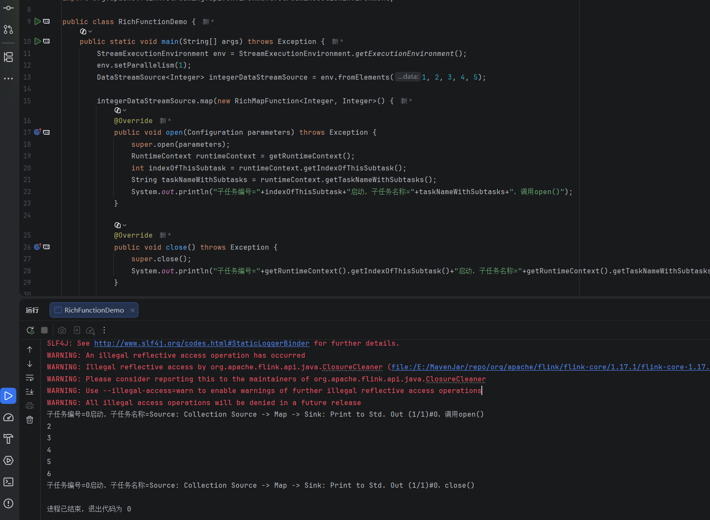
87. <mark>分区(一个子任务，可以理解为一个分区，这和kafka的分区不是一个概念哈)算子：所有算子都是重分区算子，会划分出新的task。在flink中，如果下游算子并行度为n，那么当前算子的每一条输出数据只会路由到下游其中一个子任务，路由规则由当前算子的数据分发策略决定，分发策略如下：</mark>
    * `shuffle()`：随机分区，每一条数据都有机会被分配到任意一个分区中，然后每个子任务执行自己的数据
    * `rebalance()`：轮询分区，将数据挨个分配到分区中，然后每个子任务执行自己的数据（这是默认方式，无 keyBy 的算子默认策略）
    * `rescale()`：缩放轮询分区，将数据根据分区数进行缩放，然后每个子任务执行自己的数据，如：
    ```txt
    集群共 2 台机器 TM1、TM2
    上游 Source 并行度 = 4
    TM1 承载上游子任务：Source-0、Source-1
    TM2 承载上游子任务：Source-2、Source-3
    下游 Map 并行度 = 4
    TM1 承载下游子任务：Map-0、Map-1
    TM2 承载下游子任务：Map-2、Map-3
    
    TM1 内部
    上游 Source-0、Source-1 的数据，只会发给本机 Map-0、Map-1，轮询分发：
    Source-0 → Map-0 → Map-1 → Map-0 → Map-1…
    Source-1 → Map-0 → Map-1 → Map-0 → Map-1…
    TM2 内部
    上游 Source-2、Source-3 的数据，只会发给本机 Map-2、Map-3：
    Source-2 → Map-2 → Map-3 → Map-2 → Map-3…
    Source-3 → Map-2 → Map-3 → Map-2 → Map-3…
    ```
    * `broadcast()`：广播：发送给下游所有的子任务，即所有的分区，每个子任务都会收到，比如`print()`时，那么并行执行的`print()`算子会收到source的所有数据
    * `global()`：全局分区，将所有数据只发送给下游算子的第一个子任务中，即强行让下游子任务并行度为1
    * `keyBy()`：根据key进行分区，将相同key的数据分到同一个分区中
    * `forward()`：one-to-one分区
    * 自定义分区器：
    ```java
    public class MyPartitioner implements Partitioner<String> {
      @Override
      public int partition(String key, int numPartitions) {// numPartitions是下游算子的并行度
          return Integer.parseInt(key)%numPartitions;
      }
    }
    
    public static void main(String[] args) throws Exception {
        StreamExecutionEnvironment env = StreamExecutionEnvironment.getExecutionEnvironment();
        env.setParallelism(2);
        DataStreamSource<String> socketDS = env.socketTextStream("localhost", 7777);
        socketDS.partitionCustom(new MyPartitioner(), value -> value).print();
        env.execute();
    }
    ```
    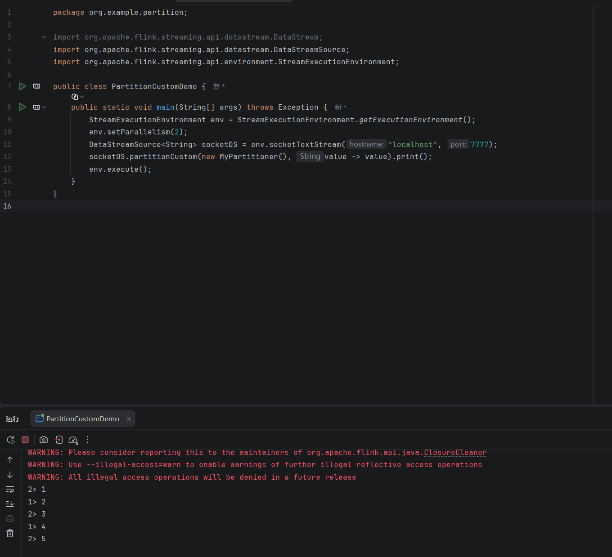(奇偶数据的分区不同，即在不同的下游子任务中运行)
88. <mark>`process()`算子不是单一方法，是底层通用处理API(process() 是 Flink 底层万能处理入口，普通流用 ProcessFunction，分组流用 KeyedProcessFunction)，所有转换算子底层最终都基于Process系列函数实现（map/filter/flatMap/window/keyBy 底层封装的都是 Process），其优势：</mark>
    * 相比 map/filter 只能处理单条数据，Process 函数可以拿到 上下文 Context，具备四大独有能力：
      * 获取当前数据时间（处理时间 / 事件时间）
      * 注册定时器（Timer，延迟触发逻辑）
      * 读写键控状态 State
      * 侧输出流 SideOutput 分流
    * 分为两大类：
      * 无key普通流：`ProcessFunction`：适用于没有分组的普通流，不能使用键控状态、不能注册定时器，只能做基础处理 + 侧输出
      ```java
      /**
      * value:当前流入的单条数据
      * ctx:上下文，包含当前数据的时间、key等信息
      * out:输出收集器，主流输出
      **/
      SingleOutputStreamOperator<WaterSensor> process = sensorDS.process(new ProcessFunction<WaterSensor, WaterSensor>() {
            @Override
            public void processElement(WaterSensor value, Context ctx, Collector<WaterSensor> out) throws Exception {
                String id = value.getId();
                if ("s1".equals(id)) {
                    // 如果是s1，放到测输出流s1中
                    ctx.output(s1Tag, value);// 把当前这条数据，输出到独立的侧输出流s1Tag中，而不是主流
                } else if ("s2".equals(id)) {
                    // 如果是s2，放到测输出流s2中
                    ctx.output(s2Tag, value);
                } else {
                    // 如果是s3，放到主流中
                    out.collect(value);
                }
            }
      });
      ```
      * keyBy键控流：`KeyedProcessFunction`(`keyBy()`之后的流)：keyBy 分组后专用，支持状态 + 定时器 + 上下文 + 侧输出，开发复杂业务首选
      ```java
      KeyedStream<String, String> keyStream = stream.keyBy(s -> s);
      keyStream.process(new KeyedProcessFunction<String, String, String>() {
      // 生命周期初始化（富函数能力）
         @Override
          public void open(Configuration parameters) {
            // 注册状态
            countState = getRuntimeContext().getState(new ValueStateDescriptor<>("cnt", Long.class));
          }
          // 每条数据进来必执行的核心方法
          @Override
          public void processElement(String value, Context ctx, Collector<String> out) throws Exception {
            // 1. 获取当前key
            String currentKey = ctx.getCurrentKey();
            // 2. 读写键控状态
            Long cnt = countState.value() == null ? 0 : countState.value();
            countState.update(cnt + 1);
            out.collect(currentKey + " 累计：" + (cnt + 1));
    
            // 3. 注册处理时间定时器（5秒后触发onTimer）
            long fiveSecLater = ctx.timerService().currentProcessingTime() + 5000;
            ctx.timerService().registerProcessingTimeTimer(fiveSecLater);
          }
    
          // 定时器触发回调：注册的时间到达后执行
          @Override
          public void onTimer(long timestamp, OnTimerContext ctx, Collector<String> out) throws Exception {
            // 定时器触发时，依然能拿到当前key、读写状态
            String key = ctx.getCurrentKey();
            out.collect("定时器触发，key=" + key + "，时间戳：" + timestamp);
            // 可清空状态、输出延迟数据、做过期清理
            countState.clear();
          }
      });
      ```
    * 对于`processElement`直接输出的是主流，如果要获取测流需要使用`process.getSideOutput(...)`，前提是在`processElement()`中把数据分流到了独立的测输出流`ctx.output(标签, 数据)`
    * `process()`算子是最灵活的，逻辑都是自己写的
89. 分流：将一条数据流拆分成完全独立的两条、甚至多条流。也即是基于一个DataStream，定义一些筛选条件，将符合条件的数据筛选出来放到对应的流里
    * `filter`可以实现，缺点：同一个数据要被处理两遍，也就是同一个数据要在不同流中都要判断，效率低
    * 测输出流：需要调用上下文ctx的`.output()`方法，就可以输出任意类型的数据了。而测输出流的标记和提取，都离不开一个“输出标签”，指定了测输出流的id和类型
90. 合流：
    * 联合`.union()`算子：最简单的合理操作就是直接将多条流合在一起，叫做流的“联合”。联合操作要求必须流中的数据类型必须相同，合并之后的新流会包括所有流中的元素，数据类型不变。`union`算子一次可以合并多条流：链式或者逗号分隔都可以
    * `connect()`算子：允许流的数据类型不同。`connect`不能一次合并多条流。此时得到的是一个`ConnectedStreams`对象，连接流对象可以看成是两条流形式上的“统一”，被放在了一个同一个流中；事实上内部仍保持各自的数据形式不变，彼此之间是相互独立的。
      要想得到新的`DataStream`，可以进一步定义一个“同处理”转换操作（如`CoMapFunction`），用于说明对于不同source、不同类型的数据，怎样分别进行处理转换，得到统一的输出类型。整体来看，`ConnectedStream`中的两条流可以保持各自的数据类型、处理方式也可以不同，最终
      会统一到一个类型的`DataStream`中
    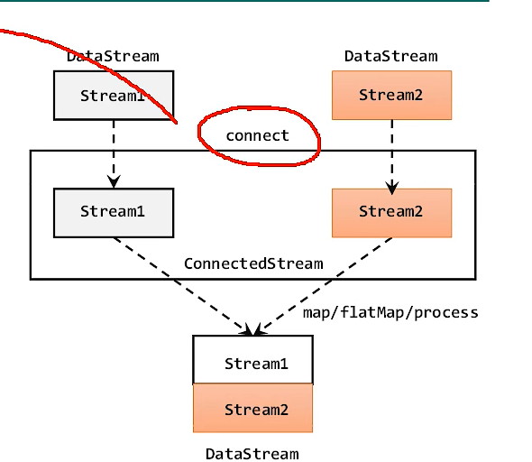
    ```java
    ConnectedStreams<Integer, String> connect = source1.connect(source2);
    SingleOutputStreamOperator<String> map = connect.map(new CoMapFunction<Integer, String, String>() {
        @Override
        public String map1(Integer value) {
            return value.toString();
        }
        @Override
        public String map2(String value) {
            return value;
        }
    });
    ```
    * 合并两条流，根据id字段进行匹配，利用`ConnectedStreams`对象的`keyBy()`方法：
    ```java
    DataStreamSource<Tuple2<Integer, String>> source1 = env.fromElements(
                Tuple2.of(1, "a1"),
                Tuple2.of(1, "a2"),
                Tuple2.of(2, "b"),
                Tuple2.of(3, "c"),
                Tuple2.of(4, "d"),
                Tuple2.of(5, "e")
                );
        DataStreamSource<Tuple3<Integer, String, Integer>> source2 = env.fromElements(
                Tuple3.of(1, "aa1", 1),
                Tuple3.of(1, "aa2", 2),
                Tuple3.of(2, "bb1", 1),
                Tuple3.of(3, "cc1", 1),
                Tuple3.of(4, "dd1", 1),
                Tuple3.of(5, "ee1", 1)
        );
        ConnectedStreams<Tuple2<Integer, String>, Tuple3<Integer, String, Integer>> connect = source1.connect(source2).keyBy(s1 -> s1.f0, s2 -> s2.f0);
        /**
         * 实现互相匹配的效果：
         * 1、两条流不一定谁的数据先来
         * 2、每条流，有数据来就先存到一个变量中
         *      hashmap
         *      =>key=id，第一个字段值
         *      =>value=List<数据><
         * 3、每条流有数据来的时候，除了存变量中，不知道对方是否有匹配的数据，要去另一条流存到变量查找是否有匹配上的数据
         */
        SingleOutputStreamOperator<Object> process = connect.process(new CoProcessFunction<Tuple2<Integer, String>, Tuple3<Integer, String, Integer>, Object>() {
            // 定义hashmap用来存数据
            Map<Integer, List<Tuple2<Integer, String>>> s1Cache = new HashMap<>();
            Map<Integer, List<Tuple3<Integer, String, Integer>>> s2Cache = new HashMap<>();

            /**
             * 第一条流的处理逻辑
             * @param value The stream element
             * @param ctx A {@link Context} that allows querying the timestamp of the element, querying the
             *     {@link TimeDomain} of the firing timer and getting a {@link TimerService} for registering
             *     timers and querying the time. The context is only valid during the invocation of this
             *     method, do not store it.
             * @param out The collector to emit resulting elements to
             * @throws Exception
             */
            @Override
            public void processElement1(Tuple2<Integer, String> value, CoProcessFunction<Tuple2<Integer, String>, Tuple3<Integer, String, Integer>, Object>.Context ctx, Collector<Object> out) throws Exception {
                Integer id = value.f0;
                // s1的数据来录就存到变量中
                if (!s1Cache.containsKey(id)) {
                    List<Tuple2<Integer, String>> s1Values = new ArrayList<>();
                    s1Values.add(value);
                    s1Cache.put(id, s1Values);
                } else {
                    // key存在，不是该key的第一条数据，直接添加到s1Cache中
                    s1Cache.get(id).add(value);
                }
                // 去s2Cache中查找是否有id能匹配上的，匹配就输出，没有就不输出
                if (s2Cache.containsKey(id)) {
                    List<Tuple3<Integer, String, Integer>> s2Values = s2Cache.get(id);
                    for (Tuple3<Integer, String, Integer> s2Value : s2Values) {
                        out.collect("s1:" + value + "<=======>" + "s2:" + s2Value);
                    }
                }
            }

            /**
             * 第二条流的处理逻辑
             * @param value The stream element
             * @param ctx A {@link Context} that allows querying the timestamp of the element, querying the
             *     {@link TimeDomain} of the firing timer and getting a {@link TimerService} for registering
             *     timers and querying the time. The context is only valid during the invocation of this
             *     method, do not store it.
             * @param out The collector to emit resulting elements to
             * @throws Exception
             */
            @Override
            public void processElement2(Tuple3<Integer, String, Integer> value, CoProcessFunction<Tuple2<Integer, String>, Tuple3<Integer, String, Integer>, Object>.Context ctx, Collector<Object> out) throws Exception {
                Integer id = value.f0;
                // s2的数据来录就存到变量中
                if (!s2Cache.containsKey(id)) {
                    List<Tuple3<Integer, String, Integer>> s2Values = new ArrayList<>();
                    s2Values.add(value);
                    s2Cache.put(id, s2Values);
                } else {
                    // key存在，不是该key的第一条数据，直接添加到s1Cache中
                    s2Cache.get(id).add(value);
                }
                // 去s1Cache中查找是否有id能匹配上的，匹配就输出，没有就不输出
                if (s1Cache.containsKey(id)) {
                    List<Tuple2<Integer, String>> s1Values = s1Cache.get(id);
                    for (Tuple2<Integer, String> s1Value : s1Values) {
                        out.collect("s1:" + s1Value + "<=======>" + "s2:" + value);
                    }
                }
            }
        });
    ```
91. `DataStream`：数据流；`KeyedStream`：键控流；`ConnectedStream`：连接流
92. 输出算子(`sink`)：
    * 内置`Sink`：`print`：打印输出
    * 通用`Sink`：`sinkTo()`：
      * 输出到文件：`FileSink`：
          * `forRowFormat`：根据行格式化输出
          * `forBulkFormat`：根据批量格式化输出
          * 写一些输出配置，比如：文件名前缀后缀、文件分桶、文件滚动策略等
      * 输出到kafka：`KafkaSink`
        * 设置kafka节点地址端口
        * 配置发送方的序列化器，topic名称，具体的序列化方式等
        * 配置写到kafka的一致性级别，如果是精准一次，必须：
          * 开启chekcpoint
          * 设置事务前缀
          * 设置事务超时时间：checkpoint间隔时间 < 超时时间 < 最大的15分钟
        ```java
        env.enableCheckpointing(2000, CheckpointingMode.EXACTLY_ONCE);
        DataStreamSource<String> localhost = env.socketTextStream("172.17.87.132", 7777);
          /**
           * 注意：如果要使用 精准一次 写入kafka，需要满足以下条件：
           * 1、开启chekcpoint
           * 2、设置事务前缀
           * 3、设置事务超时时间：checkpoint间隔时间 < 超时时间 < 最大的15分钟
           */
          KafkaSink<String> kkSink = KafkaSink.<String>builder()
                  .setBootstrapServers("172.17.87.132:9092")
                  // 指定发送方序列化器，topic名称，具体的序列化方式
                  .setRecordSerializer(
                          KafkaRecordSerializationSchema.<String>builder()
                                  .setTopic("ws")
                                  .setValueSerializationSchema(new SimpleStringSchema())
                                  .build()
                  )
                  // 写到kafka的一致性级别：精准一次，至少一次。如果是精确一次，必须设置事务的前缀
                  .setDeliveryGuarantee(DeliveryGuarantee.EXACTLY_ONCE)// 精准一次
                  .setTransactionalIdPrefix("bytedance-")
                  // 如果是精准一次，必须设置事务的超时时间
                  .setProperty(ProducerConfig.TRANSACTION_TIMEOUT_CONFIG, 10*60*1000+"")
                  .build();
        localhost.sinkTo(kkSink);
        ```
        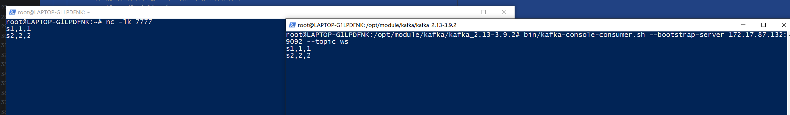
          * 可以自定义kafka中的序列化器，也就是实现`setRecordSerializer`中的`serialize`方法
        ```java
        .setRecordSerializer(
              new KafkaRecordSerializationSchema<String>() {
                  @Nullable
                  @Override
                  public ProducerRecord<byte[], byte[]> serialize(String element, KafkaSinkContext context, Long timestamp) {
                      String[] fields = element.split(",");
                      byte[] key = fields[0].getBytes(StandardCharsets.UTF_8);// key
                      byte[] value = element.getBytes(StandardCharsets.UTF_8);
                      return new ProducerRecord<>("ws", key, value);
                  }
              }
        )  
        ```
      * 输出到mysql：只能用老的sink写法：`addsink()`
        * 引入jdbc依赖，`mysql-connector-java`、`flink-connector-jdbc`
        * `JdbcSink.sink()`的四个参数：
          * 第一个参数：执行的sql，一般就是insert to等
          * 第二个参数：预编译sql，对占位符填充值
          * 第三个参数：执行选项---》攒批、重试等
          * 第四个参数：连接选项---》url、用户名、密码
