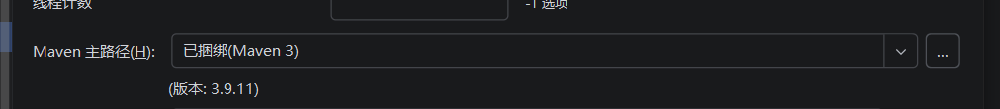
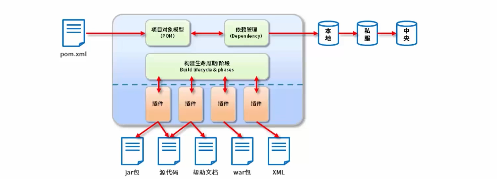
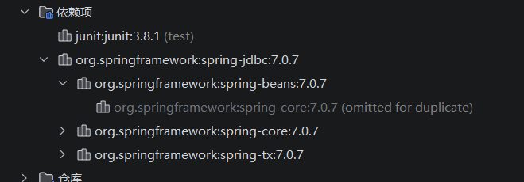
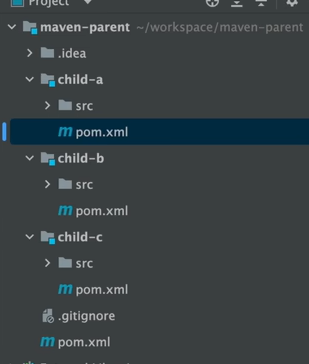

1. Maven的本质是一个项目管理工具，将项目开发和管理过程抽象成一个项目对象模型（Project Object Model，POM）。go的项目管理工具是Go Modules`go mod`；cpp的项目管理工具是`cmake`
2. Maven 是 Java 世界的项目自动化管理工具，专门帮 Java 程序员解决两个最头疼的问题：管理第三方库 + 自动化编译打包
3. Maven在IDEA中是有内置的，但是IDEA 自带 Maven 只局限在 IDEA 软件内部使用；手动安装的 Maven 是装在操作系统里，全系统通用，手动安装 Maven 并配置环境变量：电脑全系统全局可用，任意文件夹、任意终端都能执行 mvn clean/package/test/deploy
   
4. 在没有 Maven 的年代，写 Java 项目全靠手动：
    * 找 jar 包：想用一个第三方工具（比如连接数据库、解析 JSON），要去官网手动下载 .jar 包；
    * 导包：复制到项目里，手动配置路径；
    * 版本地狱：包和包之间版本冲突、依赖嵌套，直接报错；
    * 手动构建：编译代码、打包项目、运行测试，全靠敲命令 / 点鼠标，繁琐又容易
5. maven包括的流程：compile（编译业务代码（src/main/java）） → test-compile（编译测试代码（src/test/java）） → package （打包成 jar/war 包） → install （安装到本地仓库（本机共享）） → deploy （部署到远程仓库（团队共享））
   
6. maven流程分别对应的指令：
    * mvn compile → 只执行到 compile
    * mvn test → 先执行 compile，再执行 test
    * mvn package → 先执行 compile → test，再执行 package
    * mvn install → 执行到 package 后，再执行 install
    * mvn deploy → 执行到 install 后，再执行 deploy
7. 实际开发中，打包之前需要先`clean`，清理之前的打包结果
8. maven的功能：
    * 依赖管理（核心！最有用）：不用手动下载任何 jar 包，你只需要在配置文件里写一句你要什么库、什么版本，Maven 会自动从云端仓库下载，自动处理依赖关系，彻底告别手动导包
    * 自动化构建：一键完成编译、测试（运行我自己写的测试代码）、打包、部署(将项目构建好的最终产物（如 JAR/WAR 包）+ POM 文件，上传到远程仓库，供团队 / 其他项目共享使用的过程)。Java 代码不能直接运行，需要编译成字节码，再打包成可运行的包。Maven 定义了标准化流程，一行命令就能做完所有事
9. Maven 的核心文件：`pom.xml`，对应Go 的`go.mod`；cpp的`CMakeLists.txt`。这个文件里只写三件事： 项目的名称、版本；你需要依赖的第三方库（核心）；项目如何构建、打包
10. Maven仓库就是存放jar包的地方，分为本地仓库、私服仓库（远程仓库，一般是公司内部的私服）、中央仓库（Maven官方维护的开源仓库）。Maven下载包的时候会先去本地仓库查找，如果没有，会去私服仓库查找，最后会去中央仓库查找。后续从中央仓库和私服仓库下载的jar包就会下载到本地，只需要点击idea中maven工具栏中的重载按钮即可
11. 当你执行 Maven 的构建命令（比如`mvn test`等）时，Maven 会自动找到你写的所有测试代码，批量运行一遍
12. Maven项目可以手动使用Maven命令生成，也可以直接在IDEA中创建Maven项目
13. 生命周期是各种插件实现的，Maven插件包括：`compiler、clean、test-compiler、package、install、deploy`等
14. IDEA中可以直接在右侧的Maven工具栏中双击对应生命周期下面的阶段就可以直接执行该阶段了，需要注意此时是对所有业务代码或测试代码进行的，而不是某个具体的业务代码
15. Maven 是为了管理「整个项目」而生的工具，默认就是针对项目里的所有业务代码进行编译、测试、打包等全流程操作的，默认作用域都是整个项目，而不是单个文件，设计来就是为了整个项目。如果要单独对某个文件进行编译、运行，可以用jdk的命令`javac、java`
16. 常用的命令是`mvn clean compile`和`mvn clean package`
17. `pom.xml`中的`<name>`和`<url>`对项目执行无影响，只是影响可读性而已
18. `mvnreposittory`网站是一个maven的jar包搜索引擎，就可以找到需要的某个版本的jar包的坐标了，比如：
   ```xml
   <!-- Source: https://mvnrepository.com/artifact/org.springframework/spring-jdbc -->
   <dependency>
       <groupId>org.springframework</groupId>
       <artifactId>spring-jdbc</artifactId>
       <version>7.0.7</version>
       <scope>compile</scope>
   </dependency>    
   ```
19. 将找到的jar包的坐标直接复制到`pom.xml`文件中就是添加依赖了
20. 依赖是具有传递性的，直接写在`pom.xml`文件中的依赖叫直接依赖，当直接依赖又依赖了其它jar包时，这些被依赖的jar包就是间接依赖，maven会自动解析这些依赖关系，并下载相关jar包
21. <mark>需要注意的是：只有依赖范围是`compile`的依赖才会被传递</mark>
22. `pom.xml`中的`<scope>`：指的是依赖范围，test指测试的时候依赖，不会被打包到最终的jar包中。provided指在运行时提供，不会被打包到最终的jar包中，运行时由运行环境提供，这个依赖由服务器 / 容器 / Flink 框架自己提供(我本地编译需要，但运行时【别人已经提供了】，你别打包进去)
   ```xml
   <dependency>
      <groupId>junit</groupId>
      <artifactId>junit</artifactId>
      <version>3.8.1</version>
      <scope>test</scope>
   </dependency>
   ```
23. 依赖传递容易出现依赖冲突问题：在项目里面添加了两个不同的模块依赖，但是这两个依赖又依赖了不同版本的同一个jar包，就会出现依赖冲突（比如：模块a依赖了模块b和模块c，而模块b和模块c又依赖了一个不同版本的同一）。此时maven会根据一定规则来解决依赖冲突，比如：最短路径优先（路径层级少的优先使用）、先声明优先（当路径层级相同时，在`pom.xml`中先声明的优先使用）
    
24. 手动解决依赖冲突：利用`<exclusion>`标签排除不需要的依赖，即在当前项目模块中的`pom.xml`中指定要排除的一个依赖，也就是我要用另一个依赖了不同版本的同一个jar包的依赖作为依赖（假设：模块a依赖了模块b和模块c，而模块b和模块c又依赖了一个不同版本的同一个jar包。此时手动解决就只需在模块a的pom文件中对模块b依赖时添加`<exclusion>`）。<optional>`标签指定是否可选依赖
25. <mark>父子工程：在一个实际项目中可能会有多个模块，这些模块之间可能会有依赖关系，如果每个模块都单独配置一遍这些依赖的话，会很麻烦，并且不利于统一管理，这种情况就可以用父子工程来管理公共依赖。父工程只需要将`pom.xml`中的`<packaging>`标签中的内容设置为`pom`即可，此时这个工程只是用来管理其它子工程的，不会生成任何`jar`和`war`包，因此可以直接删除`src`目录。创建子工程只需要在父工程鼠标右键新建模块即可</mark>
    
26. 直接对父工程进行编译、打包`mvn clean 、mvn compile`等操作会对所有子工程进行对应的操作，即父工程有聚合的作用
27. 常见的做法是：
    * 父工程：
        * 统一管理所有版本号（Spring、MyBatis、MySQL、工具包……），写在`<dependencyManagement>`里
        * 引入所有模块都必须用的公共依赖，`<dependencies>`
    * 子工程：自己需要什么 jar，就引什么，只写 groupId + artifactId，不写version
28. 依赖继承：子工程会继承父工程的依赖，即子工程不需要再配置依赖，直接使用即可，也就是父工程中的`<dependencies>`中的依赖子工程是完全不用写的；而`<dependencyManagement>`里的，所以子工程必须自己写依赖，但可以不写 version
29. 私服仓库的作用：
    * 作为中央仓库的代理，提高下载速度
    * 保存一些公司自主的jar包
30. 私服仓库配置可以直接在`settings.xml`中修改`<mirror>`标签
31. 配置发布的快照版本：在`pom.xml`中添加`<snapshotRepository>`标签就是用来配置把这个jar包发布到哪里（比如：私服仓库），发布的是一个快照版本；`<releaseRepository>`标签就是用来配置把这个jar包发布到哪里（比如：私服仓库），发布的是一个正式版本
32. Maven是通过`pom.xml`中的`<version>`来判断是上传到快照版本还是正式版本，如果是快照版本，就需要在`<version>`中添加`-SNAPSHOT`，比如正式版本是`1.0.0`，那么快照版本就是`1.0.0-SNAPSHOT`，此时就会上传到快照目录里面，然后就会上传到已经在`pom.xml`中配置好的快照版本的仓库上传地址
33. 正式版本的jar包一般是不会被覆盖的，快照版本是会被覆盖的（只要版本号一致就行）